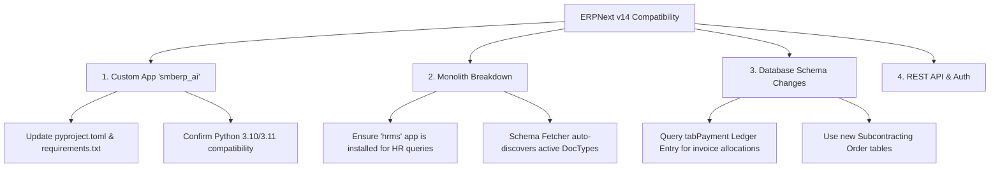

# ERPNext v14 Compatibility Plan

This document outlines the analysis, required changes, and installation requirements to ensure that the **AI Dashboard** is fully compatible with **ERPNext v14**.

---

## 🔍 Architecture Overview
The AI Dashboard (`erp_ai`) runs as a standalone Python FastAPI application. It interfaces with ERPNext remotely using two main mechanisms:
1. **Frappe REST API:** Used for dynamic schema metadata discovery (`schema_fetcher.py`).
2. **Custom Whitelisted API Endpoint:** Runs database queries via the `smberp_ai` custom app (`erp_client.py`).

Since `erp_ai` does not run directly within the Frappe Bench Python environment, local code compatibility issues (e.g. Python 3.13 dependencies) do *not* impact the Frappe/ERPNext server. However, database schemas and API behaviors require alignment.

---

## 🛠️ Key Compatibility Areas & Action Items

### 1. Custom Frappe App (`smberp_ai`)
The API dashboard calls the endpoint `/api/method/smberp_ai.api.run_ai_query` to execute read-only queries.
* **Python 3.10/3.11 Compatibility:** Frappe v14 runs on Python 3.10 or 3.11. The python code inside `smberp_ai` must be validated to ensure it runs correctly on these versions.
* **App Metadata Structure:** Frappe v14 uses `pyproject.toml` to manage app metadata and dependencies instead of the legacy `requirements.txt`. The `smberp_ai` app configuration must declare compatibility with Frappe v14 in its `hooks.py` and `pyproject.toml`.

### 2. Monolith Breakdown (Split Apps)
In ERPNext v14, several core modules were extracted into separate standalone applications:
* **HR & Payroll** $\rightarrow$ `hrms`
* **Education** $\rightarrow$ `education`
* **Healthcare** $\rightarrow$ `healthcare`
* **Agriculture** $\rightarrow$ `agriculture`

> [!IMPORTANT]
> **Impact on AI Dashboard:**
> Since `schema_fetcher.py` pulls the live schema dynamically from the target site, the AI will auto-ground itself based on what's active. However, if a user queries HR data (e.g., salaries, leaves), the site administrator **must** ensure the `hrms` app is installed on the v14 bench. Otherwise, the schema fetcher will fail to locate the tables, and the AI will flag them as missing.

### 3. Database Schema Refactors in v14
ERPNext v14 introduced several structural database changes:
* **Payment Ledger (`tabPayment Ledger Entry`):** Payment allocations are now tracked in a centralized ledger instead of invoice/payment links in `tabGL Entry` or `tabPayment Entry Reference`. Any custom overrides or dashboards querying outstanding amounts should join `tabPayment Ledger Entry`.
* **Subcontracting Module:** Dedicated doctypes (`tabSubcontracting Order`, `tabSubcontracting Receipt`) replaced checkbox flags on Purchase Orders/Receipts.
* **Asset Depreciation:** Standardized into newer tables.

### 4. REST API & Authentication
* Standard token-based auth (`Authorization: token api_key:api_secret`) and JSON endpoint returns remain identical in v14.
* Core CRUD endpoints like `/api/resource/System Settings` and `/api/resource/Company` do not require changes.

---

## 📋 ERPNext v14 Setup Checklist

- [ ] **Custom App Installation:**
  Install `smberp_ai` on the ERPNext v14 bench and run migrations (`bench migrate`).
- [ ] **API Access & Key Generation:**
  Generate API Keys and Secrets for the user role that will execute queries. Ensure this user has read permissions for the target tables.
- [ ] **Split App Installation:**
  If the dashboard needs to analyze HR/Payroll, Education, or Healthcare data, verify that the corresponding separate apps (`hrms`, etc.) are installed on the bench.
- [ ] **Schema Cache Refresh:**
  Clear the schema cache in the dashboard settings or delete files in the `schemas/` directory to force a fresh schema fetch from the ERPNext v14 instance.
